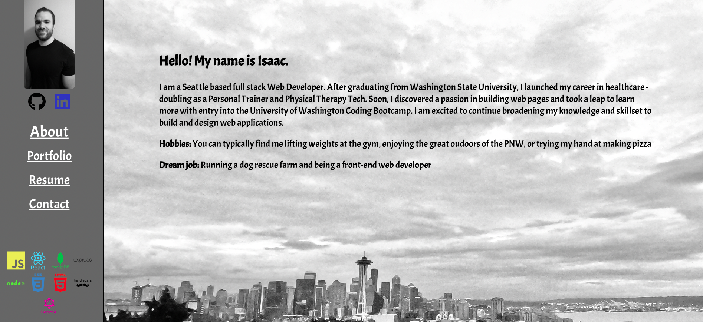

# React Portfolio

## Description

This is my portfolio build and deployed to github using react. It shows cases some of my project and work as a programmer. 

## Table of Contents

- [React Portfolio](#react-portfolio)
  - [Description](#description)
  - [Table of Contents](#table-of-contents)
  - [Installation](#installation)
  - [Usage](#usage)
  - [Credits](#credits)
  - [License](#license)
  - [Features](#features)
  - [Contributing](#contributing)
  - [Tests](#tests)
  - [Questions](#questions)

## Installation
Can be run locally by cloning the repoinstalling all the dependencies and running an npm start. 

## Usage
Can Be seen at the following link: https://iluton.github.io/Portfolio-Project/

## Credits
Just Myself

## License 

MIT
See file in the directory for more licensing information

## Features
N/A

## Contributing
N/A

## Tests
N/A

## Questions

If you have any other questions you can contact me through github at https://github.com/ILuton. My profile name is ILuton. Or you can email me at: isaacdluton@gmail.com
